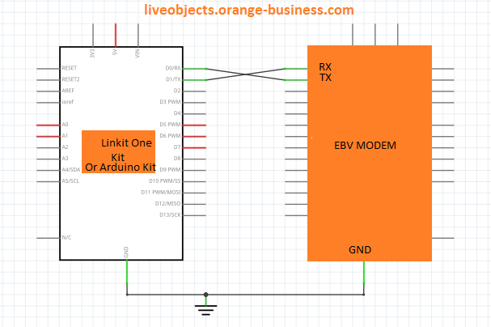
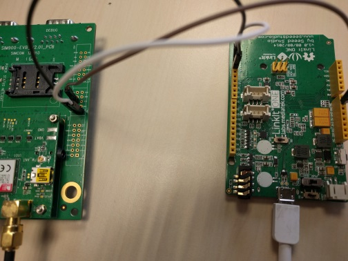

# LiveObjects IoT Client - IoTSoftBox-MQTT

Please refers to the [Changelog](ChangeLog.md) to check the latest change and improvement.

---

This repository contains LiveObjects IoT Client Library (used to connect devices to LiveObjects Server from our partners).

Visit [Datavenue Live Objects - complete guide](https://liveobjects.orange-business.com/doc/html/lo_manual.html).

And mainly the [Device mode](https://liveobjects.orange-business.com/doc/html/lo_manual.html#MQTT_MODE_DEVICE) section.

Please, have a look to the [user manual](docs/liveobjects_starterkit_arduino_v1.2.pdf) to have a presentation of the library and to be more familiar with it.

**We use the [Arduino IDE](https://www.arduino.cc/en/Main/Software) for all our operations.** Download and install it before going any further.

## Table of content

- [Requirements](#requirements)
	- [Hardware](#hardware)
	- [Software](#software)
	- [LiveObjects API Key](#liveobjects-api-key)
	- [Setup the LiveObjects header file](#setup-the-liveobjects-header-file)
		- [Configuration files](#configuration-files)
		- [API key](#api-key)
		- [Security](#security)
			- [Using internal modem](#using-internal-modem)
			- [Using external modem](#using-external-modem)
- [LinkIt-ONE](#linkit-one)
- [Usage](#usage)
	- [Library Installation](#library-installation)
	- [Select the correct board](#select-the-correct-board)
	- [Build an example](#build-an-example)
	- [Launch](#launch)
	- [Debug](#debug)
	- [Using the external modem](#using-the-external-modem)
		- [Library installation](#library-installation)
		- [Wiring](#wiring)
		- [Example](#example)
- [Libraries](#libraries)
	- [jsmn](#jsmn)
	- [paho mqtt](#paho-mqtt)
- [Application Control](#application-control)
	- [Live Objects Portal](#live-objects-portal)
	- [Live Objects Swagger](#live-objects-swagger)


## Requirements

### Hardware

* An Arduino compatible platform like :
	1. the [Mediatek LinkIt ONE](https://labs.mediatek.com/en/platform/linkit-one), with:
		1. a SIM card to use GSM/GPRS communication interface, or
	    2. the Live Booster [Heracles modem](https://www.avnet.com/wps/portal/ebv/solutions/ebvchips/heracles) and [library](https://github.com/Orange-OpenSource/LiveBooster-Heracles-Arduino) 
	2. the [Arduino MEGA](https://store.arduino.cc/arduino-mega-2560-rev3), with:
	    1. the Live Booster [Heracles modem](https://www.avnet.com/wps/portal/ebv/solutions/ebvchips/heracles) and [library](https://github.com/Orange-OpenSource/LiveBooster-Heracles-Arduino)

### Software

* [Arduino IDE](https://www.arduino.cc/en/Main/Software). Tested with ARDUINO 1.8.5.
* Install additional packages/libraries (to use your board and communication shield):
	* If you are using the LinkIt ONE board, you will need to download and install the Mediatek SDK. Procedure is described [here](https://docs.labs.mediatek.com/resource/linkit-one/en/getting-started/get-started-on-windows/install-the-arduino-ide-and-linkit-one-sdk).
	* If you are using the external Heracles modem, you will need to download the [LiveBooster-Heracles-Arduino](https://github.com/Orange-OpenSource/LiveBooster-Heracles-Arduino) library.

### LiveObjects API Key

Visit [IoT Soft Box powered by Datavenue](https://liveobjects.orange-business.com/v2/#/sdk).

1. You need to request the creation of a developer account.
1. Then, with your LiveObjects user identifier, login to the [Live Objects portal](https://liveobjects.orange-business.com/#/login).
1. Go in 'Configuration - API keys' tab, and add a new API key.
**Don't forget to copy this API key value** in a local and secure place during this operation.

### Setup the LiveObjects header file

Files in the "config" directory can be edited after the library installation.

#### Configuration files

Once the library has been installed (see [below](#library-installation)), you will be able to customize the applications behaviors. The files are located in this folder `<Arduino user dir>\libraries\iotsoftbox_mqtt_arduino\src\config`.

#### API key

The **LiveObjects API key** is in each example main file `nameOfTheExample.ino`.

For security purpose, you will need to split the ApiKey in two parts.
The first part is the first sixteen char of the ApiKey and the second one is the last sixteen char of the ApiKey.
An example is given below:

```c
// Default LiveObjects device settings: name space and device identifier
#define LOC_CLIENT_DEV_NAME_SPACE            "LiveObjectsSample"
#define LOC_CLIENT_DEV_ID                    "LO_arduino_dev01"

/** Here, set your LiveObjects API key. It is mandatory to run the application.
 *
 * C_LOC_CLIENT_DEV_API_KEY_P1 must be the first sixteen char of the ApiKey
 * C_LOC_CLIENT_DEV_API_KEY_P1 must be the last sixteen char of the ApiKey
 *
 * If your APIKEY is 0123456789abcdeffedcba9876543210 then
 * it should look like this :
 *
 * #define C_LOC_CLIENT_DEV_API_KEY_P1      0x0123456789abcdef
 * #define C_LOC_CLIENT_DEV_API_KEY_P2      0xfedcba9876543210
 *
 * */
#define C_LOC_CLIENT_DEV_API_KEY_P1			0x0123456789abcdef
#define C_LOC_CLIENT_DEV_API_KEY_P2			0xfedcba9876543210
```

#### Security

##### Using LinkIt One internal modem

From the config file `src/config/liveobjects_dev_params.h` you shall disable TLS by switching `#define SECURITY_ENABLED 1` to 0.
With the security disabled, your device will communicate in plain text with the platform.

##### Using Heracles external modem

To enable or disable security with the external modem, set SECURITY_ENABLED to 1 or 0. Recommended setting is 1.

## Usage
### Library Installation

> - Download the ZIP file from web site https://github.com/Orange-OpenSource/LiveObjects-iotSoftbox-mqtt-arduino.
>	`iotsoftbox_mqtt_arduino.zip`, containing library and examples.
> - Open your Arduino IDE and add this library through menu **Sketch** -> **Include Library** -> **Add .ZIP Library** and select the zip file : `iotsoftbox_mqtt_arduino.zip`
> - Open example sketch **File** -> **Examples** -> **LiveObjects iotsoftbox** -> **...**
> - Need to update the .ino sketch file to set your Live Objects Tenant [API key](#api-key).
> - For LinkIt ONE board with internal modem, you may need to edit `liveobjects_sample_basic_mdk.h`  file to set your SIM parameters: **GPRS_APN** , **GPRS_USERNAME** , **GPRS_PASSWORD**.

### Select the correct board

- Mediatek LinkIt ONE:
	* **Tools -> Boards -> LinkIt ONE**
	* **Tools -> Programmer -> LinkIt Firmware Updater**
- Arduino MEGA ADK:
	* **Tools -> Boards -> Arduino Mega ADK**

### Build an example

To build an example in the IDE, just use Sketch -> Verify/Compile.

#### Using the external modem

**To make examples run you need to go into** `src/config/liveobjects_dev_params.h` and change this :
  ```c
  // The flag define the modem to use
  #define ARDUINO_CONN_ITF  -1 // Internal modem
  //#define ARDUINO_CONN_ITF  4 // External modem
  ```
Into this :
  ```c
  // The flag define the modem to use
  //#define ARDUINO_CONN_ITF  -1 // Internal modem
  #define ARDUINO_CONN_ITF  4 // External modem
  ```

##### Library installation

To use the external modem (Heracles), you need to download and install the [LiveBooster-Heracles-Arduino](https://github.com/Orange-OpenSource/LiveBooster-Heracles-Arduino) as an Arduino library.

> - Download the ZIP file from web site https://github.com/Orange-OpenSource/LiveBooster-Heracles-Arduino containing the library and examples.
> - Open your Arduino IDE and add this library through menu **Sketch** -> **Include Library** -> **Add .ZIP Library** and select the zip file : `LiveBooster-Heracles-Arduino.zip`.

##### Wiring

This is how you should link the two boards (modem + LinkIt ONE) :

| Heracles modem | Arduino board |
|----------------|---------------|
|    GND         |       GND     |
|     TX         |        RX     |
|     RX         |        TX     |



And physically :



#### Using the internal LinkIt One modem

**To make examples run you need to go into** `src/config/liveobjects_dev_params.h` and change this :
  ```c
  // The flag define the modem to use
  //#define ARDUINO_CONN_ITF  -1 // Internal modem
  #define ARDUINO_CONN_ITF  4 // External modem
  ```
Into this :
  ```c
  // The flag define the modem to use
  #define ARDUINO_CONN_ITF  -1 // Internal modem
  //#define ARDUINO_CONN_ITF  4 // External modem
  ```

### Launch

First, check that the correct board is chosen in Tools -> Boards. Also verify that the IDE is using the correct COM port (Tools -> Port).
To upload a program to your board: Sketch -> Upload.
The target board will launch the program after the upload.

### Debug

You can change the debug Level (more or less verbose) inside each example.
  ```c
  #define DBG_DFT_TRACE_LEVEL <Debug Level>
  ```
It goes from 1 (only errors) to 7 (everything).

## Libraries

Here is a list of the third-party libraries used in this library and their utilities:

### jsmn

[jsmn](https://github.com/zserge/jsmn) (pronounced like 'jasmine') is a minimalistic JSON parser in C. It can be easily integrated into resource-limited or embedded projects.

### paho mqtt

[paho mqtt](https://github.com/eclipse/paho.mqtt.embedded-c) is part of the Eclipse Paho project, which provides open-source client implementations of MQTT and MQTT-SN messaging protocols aimed at new, existing, and emerging applications for the Internet of Things.

## Application Control

### Live Objects Portal

Using your Live Objects user account, go to [Live Objects Portal](https://liveobjects.orange-business.com/#/login).

### Live Objects Swagger

Go in [Live Objects Swagger User Interface](https://liveobjects.orange-business.com/swagger-ui/index.html).
